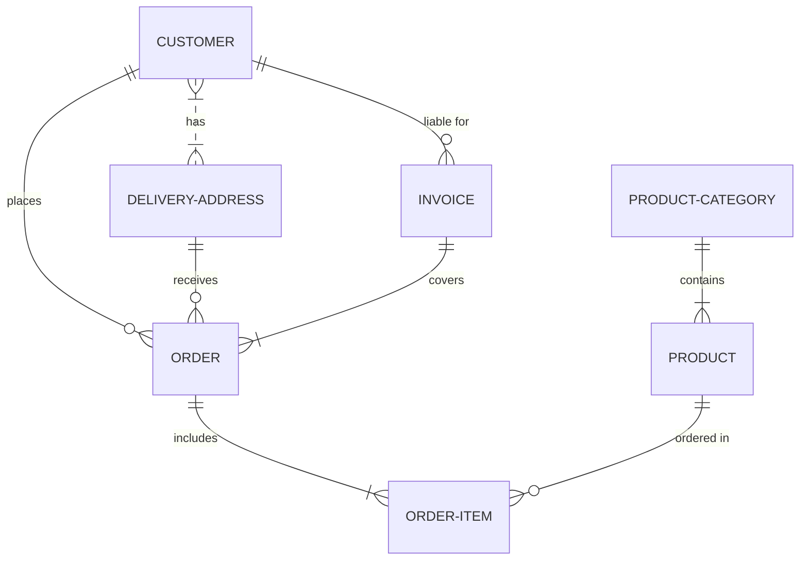

# 00. Nextjs 프로젝트에 mermaid.js 설치하기

## 1. `mermaid.js` 설치

```bash
yarn add mermaid
```


<br /><hr /><br />


## 2. `mermaid` 컴포넌트화

설치한 `mermaid.js` 는 mermaid 문법으로 작성한 `string` 을 `SVG` 로 변환한 차트를 그려줍니다.

`string` 을 `props` 로 받는 컴포넌트를 구현하면, `mermaid.js` 를 쉽게 사용할 수 있습니다.

<br />

`mermaid.js` 는 `mermaidAPI` 를 제공하며, `mermaidAPI` 를 사용하여, 렌더링할 `SVG` 에 대한 설정 및 스타일링을 할 수 있습니다.

<br />

아래 코드는 mermaid 를 사용하여 렌더링할 `mermaid 코드 (string)` 입니다.


```javascript
const mermaidCode = `
erDiagram
    CUSTOMER }|..|{ DELIVERY-ADDRESS : has
    CUSTOMER ||--o{ ORDER : places
    CUSTOMER ||--o{ INVOICE : "liable for"
    DELIVERY-ADDRESS ||--o{ ORDER : receives
    INVOICE ||--|{ ORDER : covers
    ORDER ||--|{ ORDER-ITEM : includes
    PRODUCT-CATEGORY ||--|{ PRODUCT : contains
    PRODUCT ||--o{ ORDER-ITEM : "ordered in"
`.trim();
```

<br />

위의 `mermaidCode` 를 렌더링하면 아래와 같은 `SVG` 가 렌더링 됩니다.



<br />

`mermaid.js` 를 wrapping 하는 간단한 컴포넌트를 만들면 다음과 같습니다.

```tsx
// 경로: src/components/MyMermaid.tsx

'use client';

// react
import {
    useState,
    useEffect,
    memo,
} from 'react';
// mermaid
import mermaid from 'mermaid';

type TMyMermaidProps = {
    id: string;
    mermaidCode: string;
};

function MyMermaid(props: TMyMermaidProps) {
    const {
        mermaidCode,
    } = props;

    //
    // state
    //
    const [mermaidSvgString, setMermaidSvgString] = useState<string | null>(null);

    //
    // effect
    //
    useEffect(function initMermaid() {
        // 1. initialize mermaid.js
        mermaid.initialize({
            startOnLoad: true,
        });

        // 2. initialize mermaidSvgString
        async function initMermaidSvgString() {
            const {
                svg,
            } = await mermaid.render(id, mermaidCode);

            setMermaidSvgString(svg);
        }
    }, [mermaidCode]);

    return (
        <div>
            {mermaidSvgString && (
                <pre dangerouslySetInnerHTML={{ __html: mermaidSvgString }} />
            )}
        </div>
    );
}

export default memo(MyMermaid);
```

<br />

위 코드에서 `mermaid.initialize(options)` 를 사용하여 초기화를 선행하고 있습니다.

`mermaid.initialize(options)` 함수는 인자로 받은 `options` 를 사용하여 `mermaid` 렌더링 시점, 스타일 등의 설정을 합니다.

위 코드에서 `options` 인자로 넘겨준 설정은 `startOnLoad` 는 컴포넌트가 `mounted` 되었을 때, 차트를 렌더링 할 지 여부를 설정합니다.

그러므로, 위 코드처럼 `startOnLoad: true` 설정 시, `MyMermaid` 가 `mounted` 되면 `mermaidCode` 를 읽어서 `SVG 차트` 를 렌더링 합니다. (default: true)


<br /><hr /><br />


## 3. `MyMermaid` 사용하기

위에서 작성한 `MyMermaid` 를 사용하여 `flowChart` 를 그리면, 다음과 같이 사용할 수 있습니다.

```tsx
// 경로: src/app/page.tsx

// components
import MyMermaid from '@/components/MyMermaid';

// `MyMermaid` 의 `mermaidCode` 로 넘겨줄 `string`
const mermaidCode = `
erDiagram
    CUSTOMER }|..|{ DELIVERY-ADDRESS : has
    CUSTOMER ||--o{ ORDER : places
    CUSTOMER ||--o{ INVOICE : "liable for"
    DELIVERY-ADDRESS ||--o{ ORDER : receives
    INVOICE ||--|{ ORDER : covers
    ORDER ||--|{ ORDER-ITEM : includes
    PRODUCT-CATEGORY ||--|{ PRODUCT : contains
    PRODUCT ||--o{ ORDER-ITEM : "ordered in"
`.trim();

function App() {
    return (
        <div>
            <MyMermaid mermaidCode={mermaidCode} />
        </div>
    );
}

export default App;
```
