# 01. flowchart

`flowchart` 는 프로그램의 수행 과정을 도형과 선으로 표현한 다이어그램이며, `flowchart` 를 통해서 대략적인 프로세스를 파악하기 위한 목적을 가집니다.

개발하기 위한 설계 단계에서 문서화에 활용할 수 있으며, 도출된 `flowchart` 는 좋은 공유 문서가 됩니다.

또한 설계 후, 개발 단계에서 처음 떠올렸던 방향을 잃지 않고 구체화 할 수 있다는 점에서 더 체계적인 개발을 할 수 있도록 가이드였할을 해줍니다.

<br />

`React` 와 `Google OAuth2` 연동을 예시로 `mermaid.js` 의 `flowchart` 를 그려보겠습니다.


<br /><hr /><br />

## 1. React 와 Google OAuth2 연동 계획하기

`flowchart` 를 그리기 전에 로그인 흐름을 정리합니다.

1. 로그인 버튼 클릭
2. Google OAuth2 `Access Token` 가져오기
    1. Google OAuth2 서버로 `리다이렉트`
    2. Google 에서 사용자에게 `동의 요청`
    3. Google OAuth2 서버 `응답 처리` (`suth-code`, `callback` 방식)
3. 응답 받은 `Access Token` 을 `Back-End Login API` 의 payload 로 전달
4. `Back-End Login API` 응답 데이터(`accessToken`, `refreshToken`) 을 `localStorage` 에 저장


<br /><hr /><br />


## 2. `mermaid.js` 기본 문법

### 2-1. chart 제목 설정

chart 의 제목을 정의할 수 있으며, 선택 사항 입니다.

```javascript
const mermaidCode = `
---
title: 차트 제목
---
`.trim();
```


<br /><hr /><br />


### 2-2. chart 유형 정의

어떤 chart 를 작성할지 정의합니다.

```javascript
const mermaidCode = `
---
title: flowchart 정의
---

flowchart LR
`.trim();
```

<br />

위 코드에서 `flowchart LR` 은 `flowchart` 를 정의한 코드 입니다.

여기서 `LR` 은 `left to right` 명령으로 `flowchart` 를 좌에서 우측 방향으로 그리는 설정 입니다.

즉, `flowchart 방향_명형어` 방식으로 `flowchart` 를 정의 합니다.

방향 명령어 종류는 다음과 같습니다.

* `TD`: 위 => 아래
* `TB`: 위 => 아래
* `BT`: 아래 => 위
* `LR`: 좌 => 우
* `RL`: 우 => 좌

<br />

아래 코드는 `위 => 아래` 방향의 `flowchart` 정의 입니다.

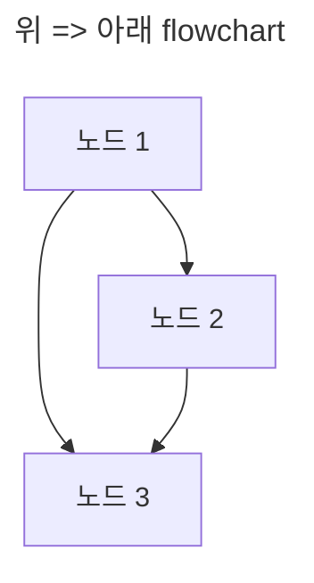

<br />

아래 코드는 `좌 => 우` 방향의 `flowchart` 정의 입니다.

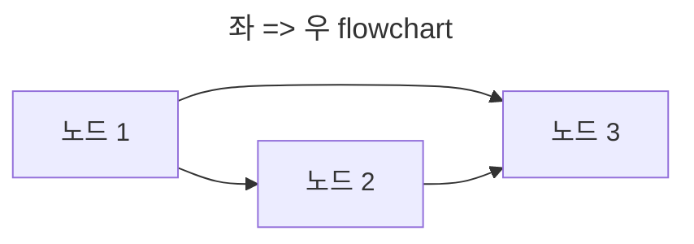


<br /><hr /><br />


### 2-3. Node 정의하기

`flowchart` 를 구성하는 모든 도형들을 `Node` 라고 합니다.

`Node` 는 역할에 따라 다양한 형태를 가집니다.

* [flowchar Node 정의 참고](https://www.smartdraw.com/flowchart/flowchart-symbols.htm)

<br />

아래 코드는 `doSomething` 이라는 `Node` 를 정의합니다.

```javascript
const mermaidCode = `
---
title: Node 정의하기
---

flowchart LR
    doSomething
`.trim();
```

<br />

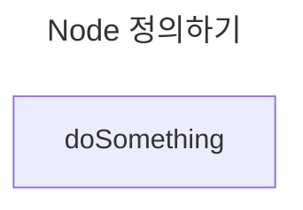


### 2-4. Node 에 unicode 로 렌더링 하기

위 예시코드에서 `doSomething` 은 정의한 이름 그대로 렌더링 됩니다.

`Node` 를 실제 렌더링 할 때 보여지는 text 를 `unicode` 로 정의할 수 있습니다.

```javascript
const mermaidCode = `
---
title: Node 에 unicode 로 렌더링 하기
---

flowchart TD
    doSomething["실행하기"]
`.trim();
```

<br />

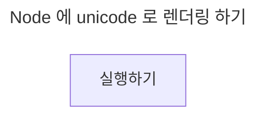


<br /><hr /><br />


## 3. flowchart `Node` 종류

`flowchart` 를 구성하는 `Node` 는 역할별로 형태를 가집니다.

* [flowchar Node 정의 참고 1](https://www.smartdraw.com/flowchart/flowchart-symbols.htm)
* [flowchar Node 정의 참고 2](https://www.zenflowchart.com/flowchart-symbols)
* [mermaid.js flowchart Node 정의 방법](http://mermaid.js.org/syntax/flowchart.html#node-shapes)


<br /><hr /><br />


### 3-1. `Action or Process` Node

`정사각형` 형태의 `Node` 입니다.

역할은 `하나의 스텝` 또는 전체를 구성하는 `서브 프로세서` 를 의미합니다.

아래의 코드에서는 `Step_1` 과 `Step_2` 로 표현하고 있습니다.

```javascript
const mermaidCode = `
---
title: Action or Process Node 1
---

flowchart LR
    Step_1["스탭 1"]
    Step_2["스텝 2"]

    Step_1 --> Step_2
`.trim();
```

<br />

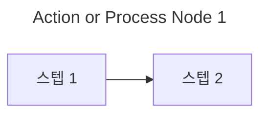


<br /><hr /><hr />


### 3-2. `subgraph` 를 사용하여 `Group Node` 만들기

`Group_1` 과 `Group_2` 는 단일 `Node` 가 아닌, `복수의 Node` 를 묶는 `Group Node` 입니다.

`Group` 에는 `subgraph` 명령을 사용하여 하위 `Node` 를 정의할 수 있습니다.

* `Group_1` 은 `Action_1` 과 `Action_2` 를 묶습니다.
* `Group_2` 는 `Action_3` 과 `Action_4` 를 묶습니다.

<br />

`subgraph` 는 `end` 로 그룹 범위를 지정해야 합니다.

또한 `subgraph` 의 렌더링 방향은 `direction TB`, `direction LR` 과 같이 정의할 수 있습니다.

<br />

```javascript
const mermaidCode = `
---
title: subgraph 를 사용하여 Group Node 만들기
---

flowchart LR
    subgraph Group_1["그룹 1"]
        direction TB

        Action_1["액션 1"]
        Action_2["액션 2"]
    end

    subgraph Group_2["그룹 2"]
        direction TB

        Action_3["액션 3"]
        Action_4["액션 4"]
    end

    Action_1 --> Action_3
    Action_2 --> Action_4
`.trim();
```

<br />

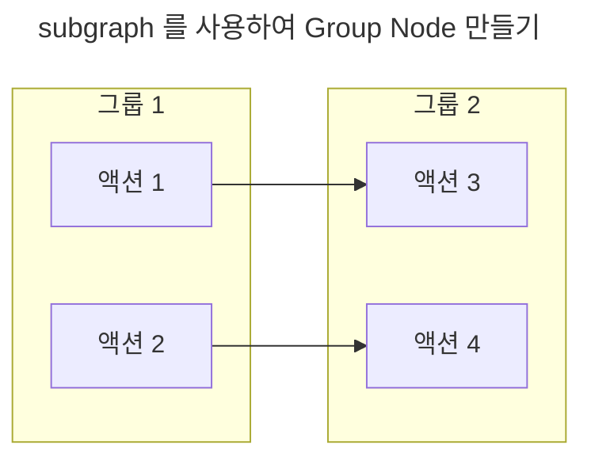


<br /><hr /><br />


### 3-3. `Alternate Process` Node

모서리가 둥근 사각형으로 `Action or Process` Node 의 `대체 Process` 를 의미 합니다.

```javascript
const mermaidCode = `
---
title: Alternate Process Node
---

flowchart LR
    AlternateProcess("대체 프로세스")
`.trim();
```

<br />

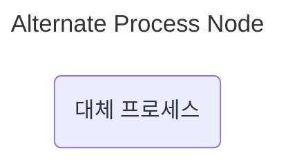


<br /><hr /><br />


### 3-4. `Terminal` Node

타원 Node 이며 `시작` 또는 `종료` 를 의미 합니다.

```javascript
const mermaidCode = `
---
title: Terminal Node
---

flowchart TB
    Start(["시작"])
    End(["종료"])

    Start --> End
`.trim();
```

<br />

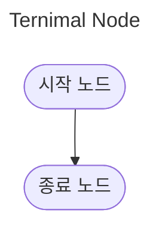


<br /><hr /><br />


### 3-5. `Subroutine` Node

액션의 흐름의 하위 액션을 나타냅니다.

즉, 커다란 액션을 수행하기 위해 필요한 하위 액션으로 정의합니다.

<br />

```javascript
const mermaidCode = `
---
title: Subroutine Node
---

flowchart TB
    subgraph Action_1["액션 1"]
        direction LR

        SubRoutine_1[["서브 루틴 1"]]
        SubRoutine_2[["서브 루틴 2"]]
    end

    Action_2["액션 2"]

    Action_2 --> Action_1
    SubRoutine_1 --> SubRoutine_2
    SubRoutine_2 --> Action_2
`.trim();
```

<be />

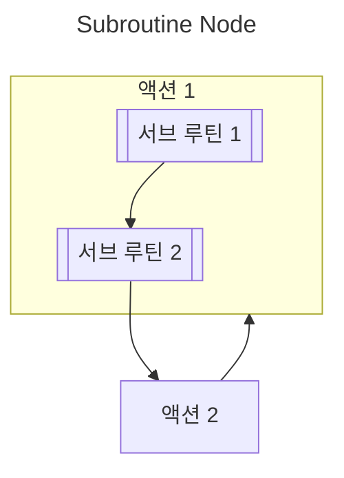


<br /><hr /><br />


### 3-6. `Cylinder` Node

실린더 형태를 가지며 `Database` 를 의미합니다.

```javascript
const mermaidCode = `
---
title: Cylinder Node
---

flowchart TB
    subgraph Submit["Form 제출하기"]
        direction LR

        checkValidation[["유효성 검사"]]
        requestQuery[["쿼리 요청"]]
        render[["렌더링"]]
    end

    DB[("MongoDB")]

    checkValidation --> requestQuery
    requestQuery --> DB
    DB --> render
`.trim();
```

<br />

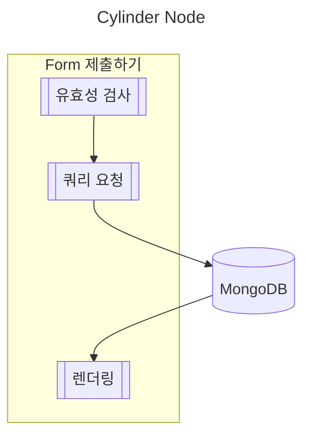


<br /><hr /><br />


### 3-7. Branch Node

마름모 형태의 Node 는 `분기점` 을 의미합니다.

`Yes/No` 와 같이 특정 조건일 떄의 흐름을 나타낼 때 사용합니다.

```javascript
const mermaidCode = `
---
title: Branch Node
---

flowchart LR
    subgraph FE["Front-End"]
        LoginButton["<로그인 버튼 컴포넌트 />"]

        subgraph MainLayout["Main Layout"]
            login[["로그인"]]
        end

        subgraph Redux
            actionRequested_produceLogin[["로그인 요청 Action"]]
            actionSucceeded_produceLogin[["로그인 성공 Action"]]
            actionFailed_produceLogin[["로그인 실패 Action"]]
        end

        subgraph ReduxSaga["Redux Saga"]
            produceLoginSaga[["로그인 Saga"]]
        end
    end

    subgraph BE["Back-End"]
        loginAPI[["로그인 API"]]
    end

    isLogin{"로그인 성공?"}


    LoginButton --> login
    login --> actionRequested_produceLogin
    actionRequested_produceLogin --> produceLoginSaga
    produceLoginSaga --> loginAPI

    loginAPI --> isLogin
    isLogin --Yes--> actionSucceeded_produceLogin
    isLogin --No--> actionFailed_produceLogin
`.trim();
```

<br />

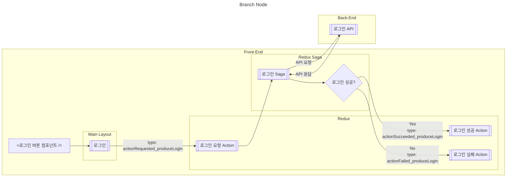


<br /><hr /><br />


## 4. Node 를 연결하는 Line

`flowchart` 를 구성하는 각 Node 는 `Line` 으로 흐름을 표현 합니다.

`mermaid.js` 에서 제공하는 `Line` 종류는 다음과 같습니다.

* 방향 여부
* 실선/점선
* 얇은선/두꺼운선
* 라인 사이 텍스트 유무
* 화살표 타입


<br /><hr /><br />


### 4-1. 방향 여부

방향 여부는 다음과 같은 선택지가 있습니다.

* 방향 없음
* 단방향
* 양방향

```javascript
const mermaidCode = `
---
title: 방향 여부
---

flowchart TB
    subgraph TwoWay["양방향"]
        Start_3(["시작"])
        End_3(["종료"])
    end

    Start_3 <--> End_3


    subgraph SingleWay["단방향"]
        Start_2(["시작"])
        End_2(["종료"])
    end

    Start_2 --> End_2


    subgraph NoneDirection["방향 없음"]
        Start_1(["시작"])
        End_1(["종료"])
    end

    Start_1 --- End_1
`.trim();
```

<br />

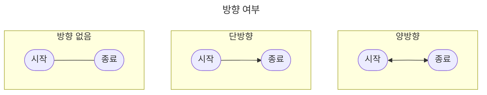


<br /><hr /><br />


### 4-2. 실선/점선

선의 종류는 `실선` 과 `점선` 이 있습니다.

```javascript
const mermaidCode = `
---
title: 실선/점선
---

flowchart TB
    subgraph DottedLine["점선"]
        Start_2_1(["시작_1"])
        End_2_1(["종료_1"])

        Start_2_2(["시작_2"])
        End_2_2(["종료_2"])

        Start_2_3(["시작_3"])
        End_2_3(["종료_3"])

        Start_2_4(["시작_4"])
        End_2_4(["종료_4"])

        Start_2_5(["시작_5"])
        End_2_5(["종료_5"])
    end

    Start_2_1 -.- End_2_1
    Start_2_2 -.-> End_2_2
    Start_2_3 <-.-> End_2_3
    Start_2_4 -.텍스트.-> End_2_4
    Start_2_5 <-.텍스트.-> End_2_5


    subgraph Line["실선"]
        Start_1_1(["시작_1"])
        End_1_1(["종료_1"])

        Start_1_2(["시작_2"])
        End_1_2(["종료_2"])

        Start_1_3(["시작_3"])
        End_1_3(["종료_3"])

        Start_1_4(["시작_4"])
        End_1_4(["종료_4"])

        Start_1_5(["시작_5"])
        End_1_5(["종료_5"])

        Start_1_6(["시작_6"])
        End_1_6(["종료_6"])
    end

    Start_1_1 --- End_1_1
    Start_1_2 --> End_1_2
    Start_1_3 <--> End_1_3
    Start_1_4 --텍스트--- End_1_4
    Start_1_5 --텍스트--> End_1_5
    Start_1_6 <--텍스트--> End_1_6
`.trim();
```

<br />

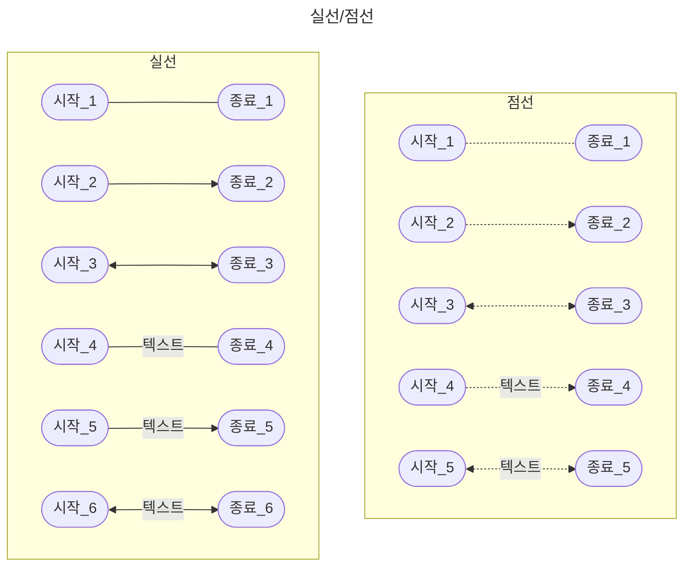


<br /><hr /><br />


### 4-3. 얇은선/두꺼운선

선의 두께는 `얇은선` 과 `두꺼운선` 을 선택할 수 있습니다.

위에서 `Line` 을 정의할 떄 사용한 `하이폰(-)` 은 `얇은선` 을 정의 합니다.

`하이폰(-)` 대신 `=` 를 사용하면, `두꺼운선` 을 정의하게 됩니다.

```javascript
const mermaidCode = `
---
title: 두꺼운선
---

flowchart TB
    subgraph ThickLine["두꺼운선"]
        Start_1(["시작_1"])
        End_1(["종료_1"])

        Start_2(["시작_2"])
        End_2(["종료_2"])

        Start_3(["시작_3"])
        End_3(["종료_3"])

        Start_4(["시작_4"])
        End_4(["종료_4"])

        Start_5(["시작_5"])
        End_5(["종료_5"])

        Start_6(["시작_6"])
        End_6(["종료_6"])
    end

    Start_1 === End_1
    Start_2 ==> End_2
    Start_3 <==> End_3
    Start_4 ==텍스트=== End_4
    Start_5 ==텍스트==> End_5
    Start_6 <==텍스트==> End_6
`.trim();
```

<br />

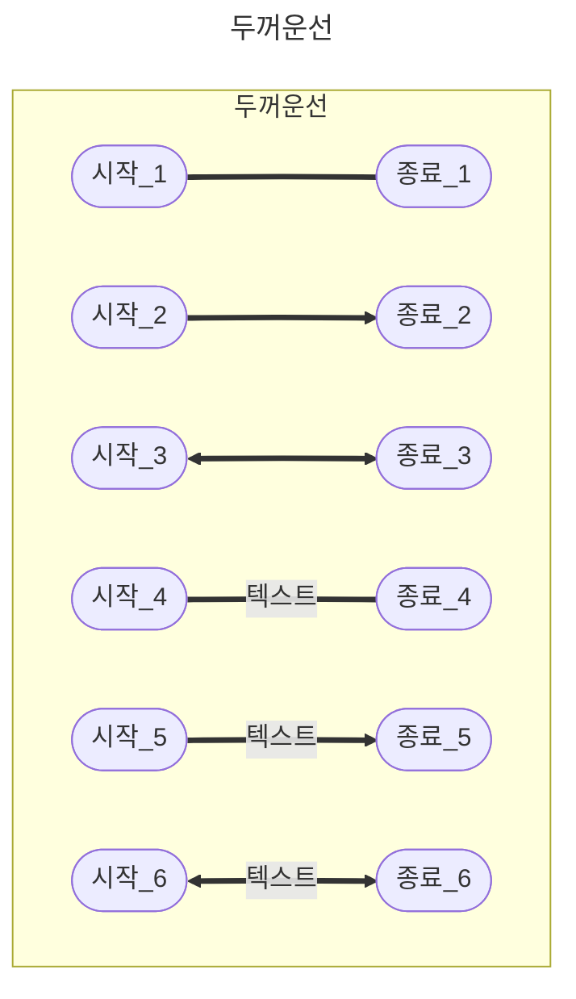


<br /><hr /><br />


### 4-4. 라인 사이 텍스트 유무

위 예시 코드들에서 사용한 것처럼 `라인 정의 사이에 텍스트` 를 작성하여 정의할 수 있습니다.


<br /><hr /><br />


### 4-5. 화살표 타입

화살표 타입은 아래 중 한가지를 사용할 수 있습니다.

* 화살표: `>` 또는 `<`
* 원: `o`
* x표: `x`

```javascript
const mermaidCode = `
---
title: 화살표 타입
---

flowchart TB
    subgraph Cross["X표"]
        Start_3(["시작"])
        End_3(["종료"])
    end

    Start_3 --x End_3


    subgraph Circle["원"]
        Start_2(["시작"])
        End_2(["종료"])
    end

    Start_2 --o End_2


    subgraph Arrow["화살표"]
        Start_1(["시작"])
        End_1(["종료"])
    end

    Start_1 --> End_1
`.trim();
```

<br />

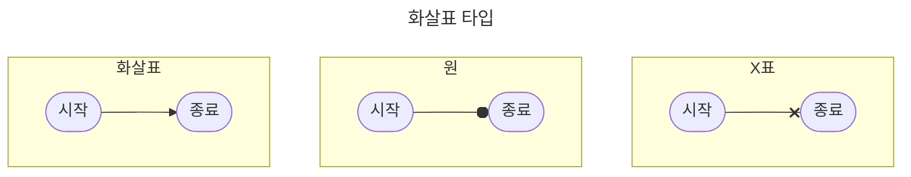


<br /><hr /><br />


## 5. Node 에 링크 연결하기 (`<a />`)

`Node` 에 `<a />` 태그 기능을 추가할 수 있습니다.

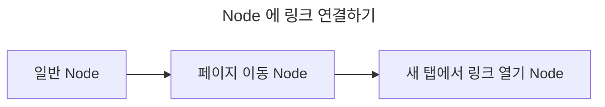


<br /><hr /><br />


## 6. Node 에 style 적용하기

각 `Node` 에 `style` 을 작성할 수 있습니다.

`mermaid.js` 의 렌더링 결과물은 `SVG` 이므로, `SVG attributes` 를 사용하여 `style` 을 정의할 수 있습니다.

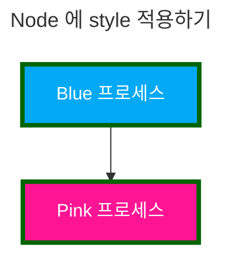


<br /><hr /><br />


## 7. Fontawesome 아이콘 사용하기

`text` 정의 시 `Fontawesome 5` 아이콘을 사용할 수 있습니다.

아이콘 삽입 형식은 `fa:아이콘_명` 입니다.

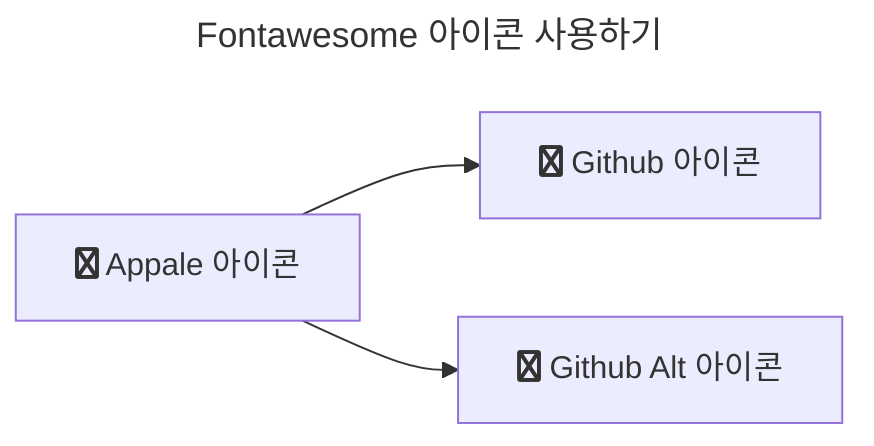
