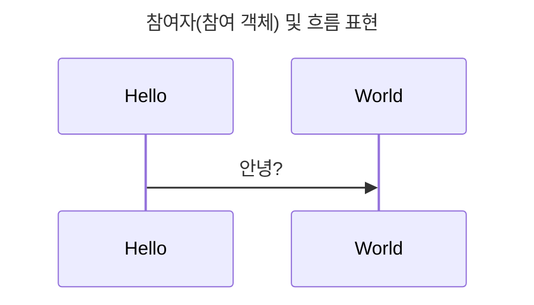
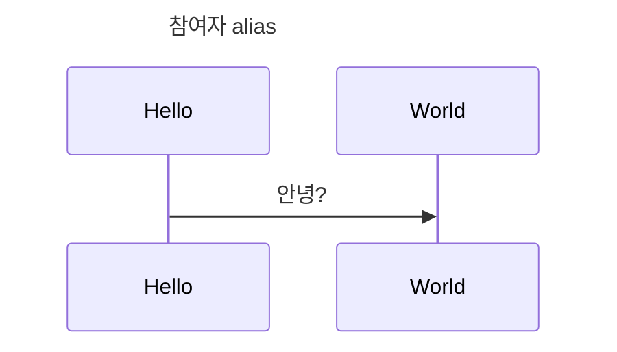
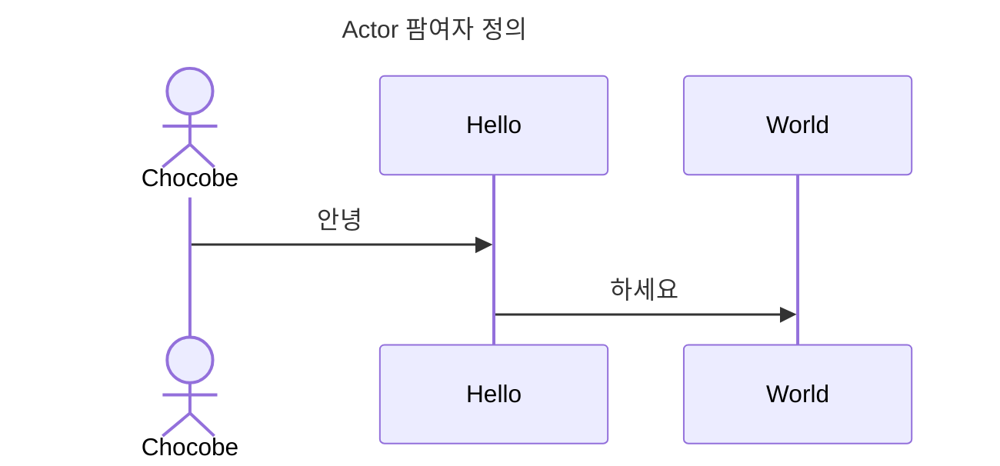
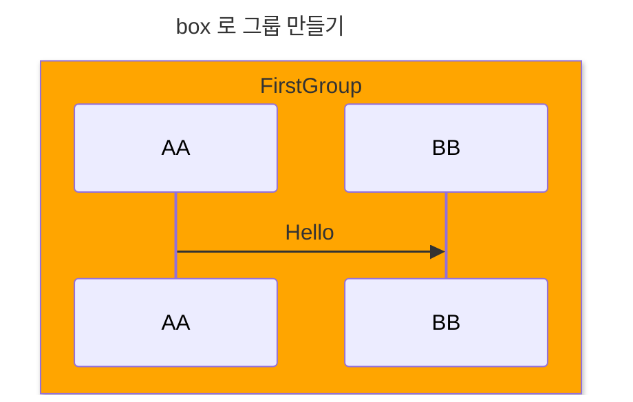
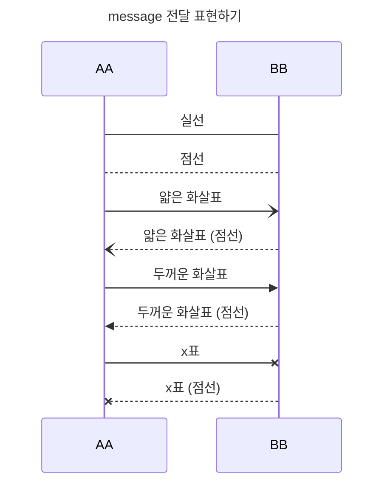
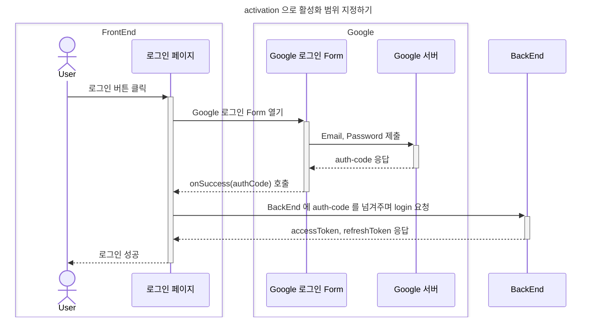
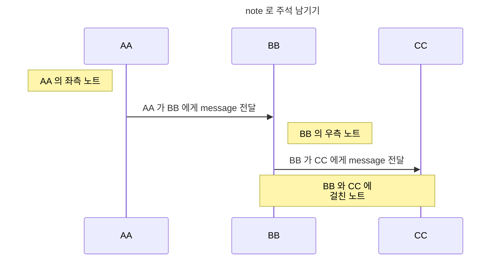
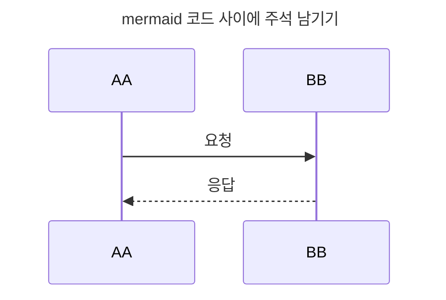
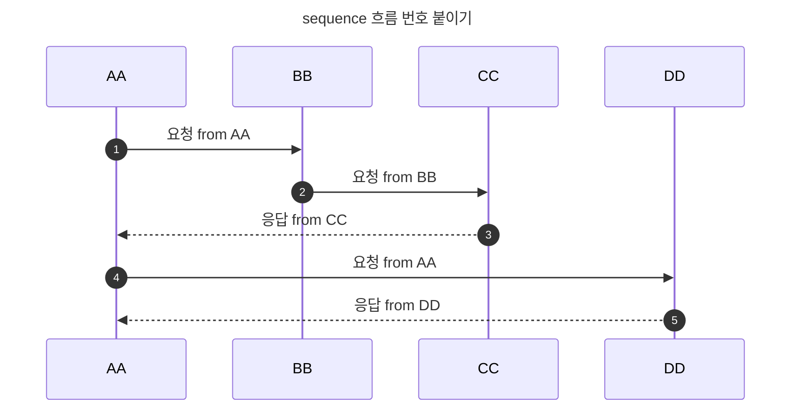

# sequenceDiagram

* `sequenceDiagram` 은 특정 목적을 위한 `operation` 들의 순서와 흐름, 상호작용을 나타내기 위한 다이어그램 입니다.


<br /><hr /><br />


## 1. 참여자(참여 객체) 및 흐름 표현

`participant` 키워드를 사용하여 참여자(참여 객체) 를 정의할 수 있습니다.

그리고 `participant` 간의 흐름을 정의하여, 상호작용이 어떻게 일어나는지를 표현 합니다.

```javascript
const meqrmaidCode = `
---
title: 참여자(참여 객체) 및 흐름 표현
---

sequenceDiagram
    participant Hello
    participant World

    Hello ->> World: 안녕?
`.trim();
```

<br />




<br /><hr /><br />


## 2. 참여자 `alias`

`participant` 로 정의한 참여자의 이름이 길 경우, 흐름을 표현할 때 타이핑이 많아집니다.

이러한 경우, `as` 키워드를 사용하여 `participant` 에 `alias` 를 부여하여 타이핑 수를 줄일 수 있습니다.

```javascript
const mermaidCode = `
---
title: 참여자 alias
---

sequenceDiagram
    participant h as Hello
    participant w as World

    h ->> w: 안녕?
`.trim();
```

<br />




<br /><hr /><br />


## 3. Actor 참여자 정의

`participant` 키워드로 정의한 참여자는 상호작용하는 객체를 나타냅니다.

만약 사용자의 interaction 을 표현하고자 할 때, `actor` 를 사용하면 좀 더 명확한 구별이 가능합니다.




<br /><hr /><br />


## 4. participant 또는 actor 생성/파괴 하기

> `v10.3.0+` 버전 이상에서만 동작합니다.
>
> VSCode markdown extension 에서 지원하지 않는 것으로 파악되었습니다 (2023. 08. 19)

`sequenceDiagram` 의 중간 흐름에서 `participant` 또는 `actor` 를 생성할 수 있습니다.

상호작용하는 두 객체의 `message` 전달을 정의하기 직전에 `create` 키워드를 사용하여 `participant` 또는 `actor` 를 생성/파괴 할 수 있습니다.

```javascript
const mermaidCode = `
---
title: participant 또는 actor 생성/파괴 하기
---

sequenceDiagram
    participant AA
    participant BB
    participant CC

    AA ->> BB: 준비

    create participant Chocobe
    BB ->> Chocobe: 생성
    Chocobe -->> CC: 보정
    CC -->> BB: 보정 결과
    BB -->> AA: 응답
`.trim();
```


<br /><hr /><br />


## 5. box 로 그룹 만들기

`box` 키워드를 사용하면 `participant` 또는 `actor` 를 그룹으로 묶을 수 있습니다.

`box 색상명 그룹명` 과 같이, `색상명` 을 사용할 경우, `box` 의 배경색으로 사용됩니다.

`box` 키워드로 그룹을 만들경우, `end` 키워드로 그룹의 마침까지 지정해주어야 합니다.

```javascript
const mermaidCode = `
---
title: box 로 그룹 만들기
---

sequenceDiagram
    box orange FirstGroup
        participant AA
        participant BB
    end

    AA ->> BB: Hello
`.trim()
```




<br /><hr /><br />


## 6. message 전달 표현하기

`message` 는 두 객체의 상호작용을 명시합니다.

표현 방식은 다음과 같습니다.

* 실선/점선
* 화살표 유무
* 화살표 모양

<br />

`실선/점선` 표현 방법은 다음과 같습니다.

* 실선: `->`
* 점선: `-->`

<br />

`화살표 유무` 는 다음과 같습니다.

* 실선
    * 화살표 있음: `->>`
    * 화살표 없음: `->`
* 점선
    * 화살표 있음: `-->>`
    * 화살표 없음: `-->`

<br />

`화살표 모양` 은 다음과 같습니다.

* 실선
    * 얇은 화살표: `-)`
    * 두꺼운 화살표: `->>`
    * `x`표: `-x`
* 점선
    * 얇은 화살표: `--)`
    * 두꺼운 화살표: `-->>`
    * `x`표: `--x`

<br />




<br /><hr /><br />


## 7. activation 으로 활성화 범위 지정하기

`message` 를 전달받은 객체는, 이 `message` 를 수행하기 위해 복수의 `operator` 를 실행해야 할 수 있습니다.

이러한 경우, 특정 `message` 를 위한 동작을 하나의 process 로 표현할 수 있는데, 이를 `activation (활성화)` 로 표현할 수 있습니다.

<br />

`activation` 은 `시작` 과 `종료` 가 있습니다.

이는 짝이 맞아야 하며, 논리적인 위치에 작성해야 합니다.

```javascript
const mermaidCode = `
---
title: activation 으로 활성화 범위 지정하기
---

sequenceDiagram
    box FrontEnd
        actor User
        participant LoginPage as 로그인 페이지
    end

    box Google
        participant GoogleForm as Google 로그인 Form
        participant GoogleServer as Google 서버
    end

    participant BackEnd

    User ->>+ LoginPage: 로그인 버튼 클릭
        LoginPage ->>+ GoogleForm: Google 로그인 Form 열기
            GoogleForm ->>+ GoogleServer: Email, Password 제출
            GoogleServer -->>- GoogleForm: auth-code 응답
        GoogleForm -->>- LoginPage: onSuccess(authCode) 호출
    LoginPage ->>+ BackEnd: auth-code 를 넘겨주며 login 요청

    BackEnd -->>- LoginPage: accessToken, refreshToken 응답
    LoginPage -->>- User: 로그인 성공
`.trim();
```




<br /><hr /><br />


## 8. note 로 메모 남기기

`sequenceDiagram` 의 중간에 `note` 를 남길 수 있습니다.

`note` 의 위치를 지정할 수 있으며, 두 객체에 걸쳐서 표시할 수도 있습니다.

<br />

아래는 `note` 의 위치 지정 키워드 입니다.

* 객체의 우측에 표시: `note right of 객체명`
* 객체의 좌측에 표시: `note left of 객체명`
* 두 객체에 걸쳐서 표시: `note over 객체A, 객체B`

```javascript
const mermaidCode = `
---
title: note 로 주석 남기기
---

sequenceDiagram
    participant AA
    participant BB
    participant CC

    note left of AA: AA 의 좌측 노트

    AA ->> BB: AA 가 BB 에게 message 전달
    note right of BB: BB 의 우측 노트

    BB -->> CC: BB 가 CC 에게 message 전달
    note over BB, CC: BB 와 CC 에<br />걸친 노트
`.trim();
```




<br /><hr /><br />


## 9. mermaid 코드 사이에 주석 남기기

`mermaid` 코드에 주석을 남길 수 있습니다.

주석처리된 코드는 실제 렌더링 되지 않습니다.

```javascript
const mermaidCode = `
---
title: mermaid 코드 사이에 주석 남기기
---

sequenceDiagram
    %% 주석 1
    participant AA

    %% 주석 2
    participant BB

    %% 주석 3
    AA ->> BB: 요청
    BB -->> AA: 응답
`.trim();
```

<br />




<br /><hr /><br />


## 10. sequence 흐름 번호 붙이기

객체들의 `message` 전달 흐름은 순서대로 진행됩니다.

좀 더 나은 가독성을 위해, 각 흐름에 순서를 표기할 수 있습니다.

`authnumber` 키워드를 사용하면, `sequenceDiagram` 전체에 순서대로 번호를 표기해 줍니다.

```javascript
const mermaidCode = `
---
title: sequence 흐름 번호 붙이기
---

sequenceDiagram
    autonumber;

    participant AA
    participant BB
    participant CC
    participant DD

    AA ->> BB: 요청 from AA
    BB ->> CC: 요청 from BB
    CC -->> AA: 응답 from CC
    AA ->> DD: 요청 from AA
    DD -->> AA: 응답 from DD
`.trim();
```

<br />

